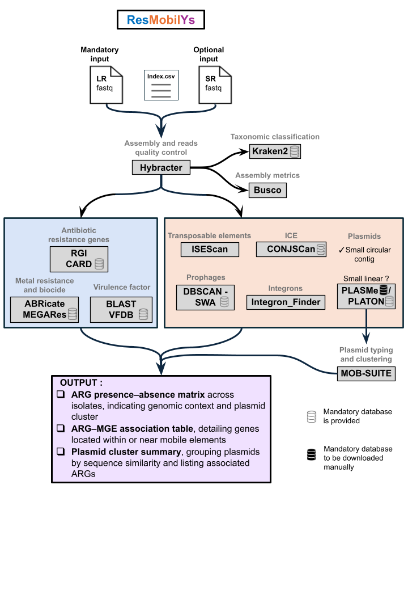

# Summary  
Mobile Genetic Elements (MGEs) are DNA segments that can move within or between genomes, enabling the transfer of genetic material between cells of the same or different species. MGEs play a crucial role in microbial ecology by facilitating the spread of genes with diverse functions across microbial populations [@rankin_what_2011]. Among them, antimicrobial resistance (AMR) genes represent a major public health concern. A recent global study estimated that in 2019, approximately 5 million deaths were associated with AMR [@murray_global_2022]. Projections suggest that this could rise to 10 million deaths by 2050 [@thompson_staggering_2022]. Besides AMR, MGEs also carry virulence factors (VFs) and heavy metal resistance genes, which enhance bacterial pathogenicity and environmental adaptation [@morales_role_2023].
Advances in high-throughput sequencing now enable large-scale sequencing of diverse bacterial isolates from human, animal, and environment sources, generating large datasets that require automated and integrated analyses to produce interpretable outputs.  

For this purpose, we developed ResMobilYs, an end-to-end Nextflow workflow [https://github.com/NjivaAndriamanga/resmobilys](https://github.com/NjivaAndriamanga/resmobilys) that performs de novo assembly and identifies MGEs, including plasmids, integrons, prophages, integrative and conjugative elements (ICEs), and transposable elements. ResMobilYs integrates tools designated to operate across the wide diversity of bacterial taxa and simultaneously detects antibiotic resistance genes (ARGs), virulence factor, and heavy metal resistance genes, providing an integrated analysis of the mobilome and associated resistome in field and clinical Eubacteria isolates.

# Statement of need  
Antimicrobial resistance (AMR) remains a major public health threat. Mobile Genetic Elements (MGEs) play a critical role in acquisition and dissemination of resistance genes to pathogenic bacteria [@pradier_ecology_2023]. Consequently, identifying and characterizing MGEs is essential for understanding AMR epidemiology. Although advances in massive parallel sequencing have made genomic analysis widely accessible, user-friendly tools for comprehensive mobilome analysis and its association with AMR remain limited. This lack of accessibile and integrated solutions represent a bottleneck for researchers seeking to investigate the role of mobilome in resistance dissemination.
Such analyses requires the integration of multiple specialized bioinformatics tools within a unified framework. To address this need, we developed ResMobilYs, an automated, all-in-one workflow for large-scale identification of MGEs and ARGs. ResMobilYs offers scalable, automated, portable, and reproducible solution for processing large genomics datasets and enables consistent comparisons across diverse bacterial samples.  

Few bacterial genomics pipelines currently support comprehensive resistome or/and mobilome analysis. Existing tools include MobileElementFinder [@johansson_detection_2020], MGEfinder [@durrant_bioinformatic_2020], and Baargin [@hayer_baargin_2023]. MobileElementFinder relies on homology-based detection using curated MGE databases, limiting its applicability to less characterized species. MGEfinder is less dependent on genome annotations but is tailored for short-read sequencing and requires a suitable reference genome. Neither tool integrates ARGs detection nor supports comparative genome analysis. Baargin includes AMR detection and plasmid identification but is mainly oriented toward strain-level analyses rather than broader inter-species comparisons.   
ResMobilYs fills these limitations by enabling plasmids recovery from long-read assemblies and identifying MGE while minimizing reliance on reference genomes. Its core components include (i) detection and annotation of ARGs, (ii) identification of MGEs combined with plasmid clustering and comparative analysis, and (iii) integration of MGE–AMR associations to characterize resistance dissemination. This design allows application across diverse bacterial taxa, including poorly characterized lineages, and provides a comprehensive framework for mobilome and resistome profiling.

# Workflow overview

## Features  
The pipeline is implemented with Nextflow [@di_tommaso_nextflow_2017], which automates workflow execution and ensures reproductibility. It can run on a wide range of computing systems, including high-performance computing (HPC) clusters, and processes samples in parallel to efficiently handle large datasets. Containerized execution with Docker/Singularity/Apptainer ensures consistent software environments, making ResMobilYs portable and easy to deploy across diverse computational setups. Most required reference databases are downloaded automatically through a dedicated setup step integrated into the workflow. This ensures that users do not need to manually retrieve or configure the majority of external resources, simplifying installation and improving reproducibility across computing environments.

## The workflow  
### Input Data
ResMobilYs accepts either long read data alone or a combination of long and short reads. Long-read sequencing enables more complete and less fragmented assemblies, substantially improving plasmid resolution.

### Genome assembly  
Genome assembly is conducted with Hybracter [@bouras_hybracter_2024], which provides highly accurate bacterial genome assemblies and enables efficient plasmids recovery from de novo assemblies.  
Taxonomic classification is performed using Kraken2 [@wood_improved_2019].  
Assembly quality is assessed using BUSCO [@manni_busco_2021].  

### Antimicrobial Resistance, Virulence , and Metal Resistance
ARGs are detected using RGI with CARD database [@alcock_card_2023], which is well suited for environmental AMR surveillance [@papp_review_2022]. Resistance determinants for metals and biocides are identified with ABRicate using the MEGARes database [@bonin_megares_2023], and virulence factors are detected using VFDB [@dong_expanded_2024].  

### Mobile Genetic Elements annotation  
An estimated chromosome size can be provided or inferred automatically with Hybracter. Small circular contigs below this threshold are classified as plasmids [@bouras_hybracter_2024], while small linear contigs are further analyzed using PLASMe [@tang_plasme_2023] or PLATON [@schwengers_platon_2020].These tools use hybrid approaches combining sequence similarity with additional features or models, enabling accurate discrimination between plasmidic and chromosomal contigs and detection of highly divergent plasmids without relying on classical markers such as replicons or relaxases.  
Plasmid typing and clustering are performed with MOB-suite [@robertson_mob-suite_2018], with MOB-typer for plasmid typing and MOB-cluster to identify similar plasmids across isolates based on complete sequence comparisons.  
Integrons are detected using IntegronFinder  [@neron_integronfinder_2022], which detects integrase using HMM profiles, predicts attC sites with sequence and structural motifs.  
ICEs are annotated using the CONJScan module of MacSyFinder [@cury_integrative_2017] and are delimited based on user-defined size thresholds.  
Insertion sequences (ISs) are identified with ISEScan [@xie_isescan_2017]. Composite transposons and transposons flanked by insertion sequences are identified using user-defined distance thresholds between IS elements.  
Prophages are predicted with DBSCAN-SWA [@gan_dbscan-swa_2022].  
By prioritizing approaches that operate beyond direct pairwise homology, the workflow enhances the detection of novel MGEs and expand mobilome exploration to uncharacterized elements.  

### Output
ResMobiLys produces both isolate-specific and global results, summarizing antimicrobial resistance and mobility features.
At the isolate level, the pipeline identifies ARGs, their genomic locations (chromosomal or plasmid), and associated MGEs while retaining individual outputs from each integrated tool for further downstream analyses.
At the global level, it generates:
- A presence–absence matrix of ARGs across isolates, including genomic context and plasmid cluster information.
- A list of ARG–MGE associations, highlighting genes located within mobile elements.
- A plasmid cluster summary, grouping plasmids by sequence similarity and their associated ARGs.

# Discussions
ResMobilYs provides a comprehensive and scalable framework for mobilome and resistome analysis, with particular strengths in plasmid recovery, clustering, and comparative analysis across diverse bacterial taxa. However, accurate delimitation of some MGEs remains challenging, especially for elements with variable boundaries or complex architectures. As knowledge of MGEs continues to evolve, the modular Nextflow design of ResMobilYs facilitates straightforward integration of improved methods, ensuring long-term adaptability and relevance of the workflow.

# Aknowledgement
We are grateful to the genotoul bioinformatics platform Toulouse Occitanie (Bioinfo Genoutl, https://doi.org/10.15454/1.5572369328961167E12) for providing computing and storage ressources.

# References
